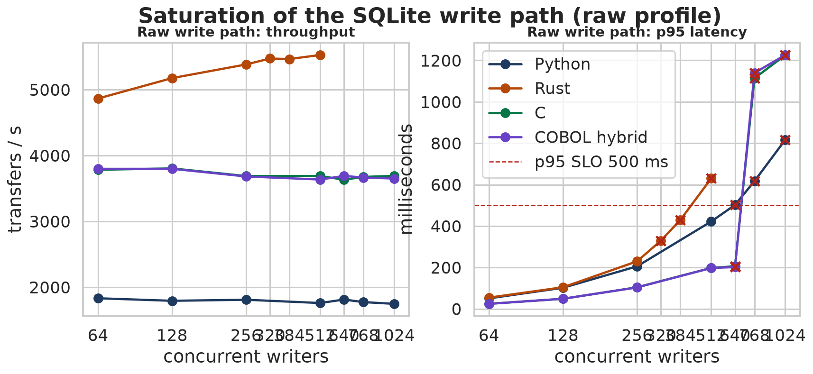
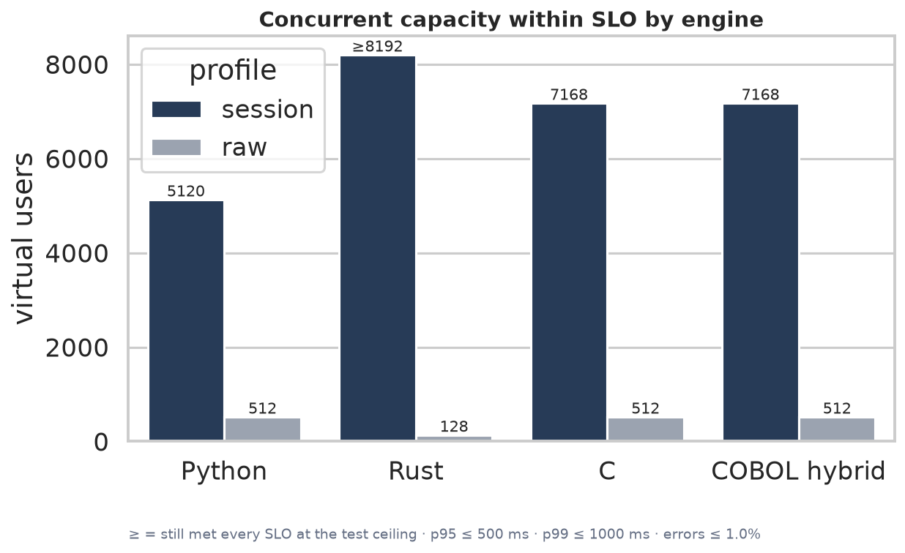
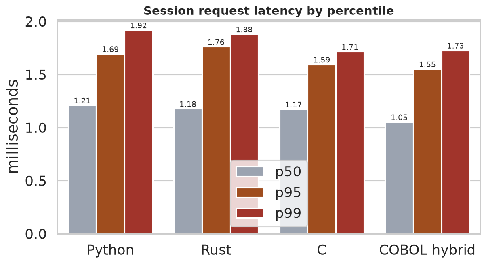
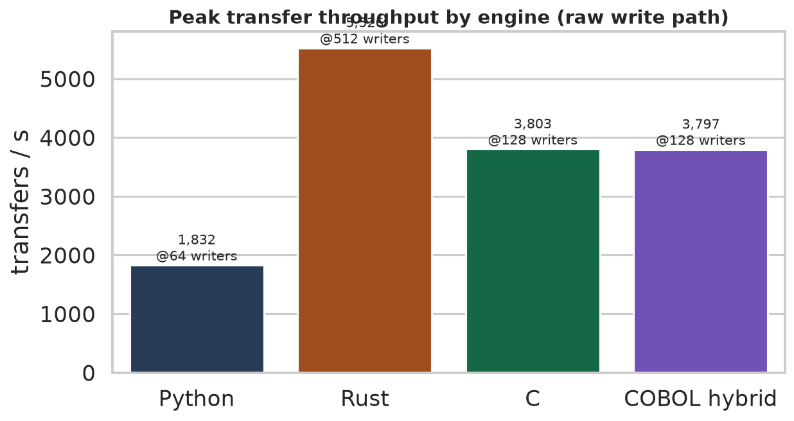
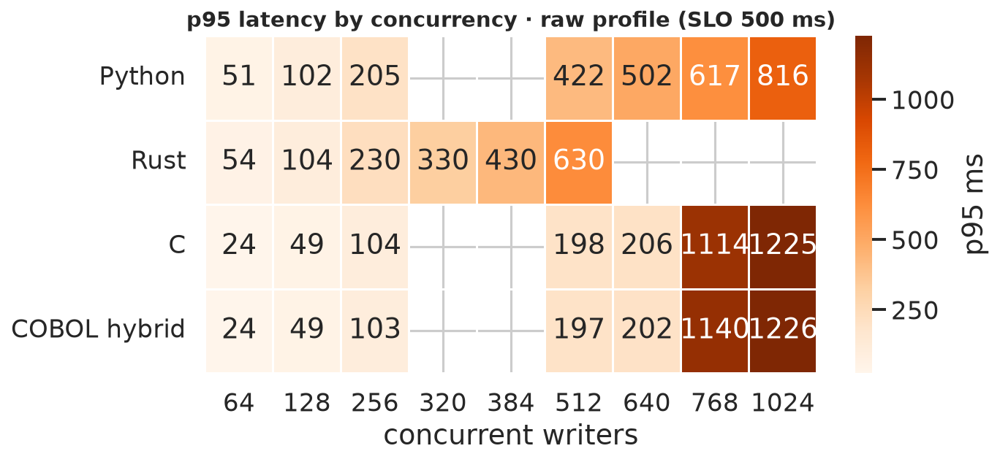
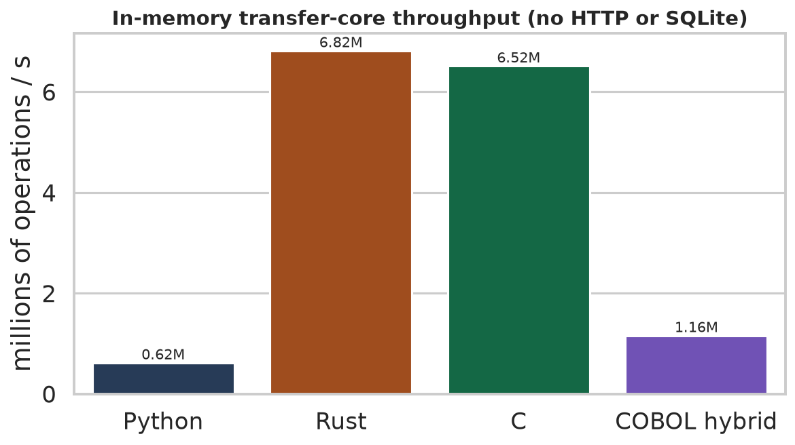

# LedgerLab

**A portable, reproducible capacity benchmark for a banking ledger — the same dual-entry backend implemented in four languages, measured against realistic virtual users and explicit SLOs.**

LedgerLab answers the question that matters in a backend review: *how many concurrent customers can this service carry before it violates its latency and error budget, and what breaks first?* It ships one HTTP contract and one double-entry accounting model implemented in **Python, Rust, C, and COBOL**, plus a managed evaluation harness that builds an engine on demand, drives **think-time virtual users**, verifies the ledger invariants, and reports where each engine saturates.



## What this demonstrates

- **Money as a ledger, not a field.** Integer minor units, one debit + one credit per transfer in a single atomic transaction, immutable journal, balances cached transactionally and reconciled against the journal after every run.
- **Correctness under concurrency.** Idempotent transfers, insufficient-funds guards, currency-mismatch handling, and automated conformance checks that gate every performance result.
- **Load-testing methodology.** Closed-loop virtual users with realistic think time, explicit service-level objectives (p95 < 500 ms, p99 < 1 s, errors < 1%), an adaptive capacity search (double + binary-search the knee), a **warm-up**, a **longer soak confirmation**, and **CPU/RSS attribution** so you can see what actually saturates.
- **Reproducible tooling.** One command to benchmark every engine and regenerate publication-ready charts; every result records runtime versions, host, timing, resources, and invariant outcomes.

## Architecture

```text
Browser UI / CLI driver
              |
      LedgerLab evaluation manager
       /       |       |      \
   Python    Rust      C     COBOL
   adapter   adapter adapter adapter
       \       |       |      /
        implementation-local ledger  (SQLite WAL)
```

Every engine is built from source, exercised through the same HTTP contract (`docs/protocol.md`), and torn down with a disposable database. The COBOL engine is a COBOL authorization core called from the shared C HTTP/SQLite adapter and is labelled as such in every result.

## Methodology

- **`session` profile (capacity).** A closed-loop banking client: read balance → pause (3–7 s) → read statement → pause (3–8 s) → 25% chance of a transfer (with a realistic idempotent retry) → pause (5–15 s), over a shared account pool. This is the "how many customers" number.
- **`raw` profile (write ceiling).** The transfer endpoint saturated with no think time — reported separately, never as user capacity.
- **SLOs.** A run passes only if p95 < 500 ms, p99 < 1 s, and errors < 1%. The **capacity run** warms up, doubles concurrency until an SLO fails, binary-searches the knee, then **confirms** the reported level with a longer soak (stepping down if it can't hold). Full details in `docs/benchmark-methodology.md`.

## Results on this host

Numbers are real, generated by the committed pipeline (`docs/sample-results.json`); charts in `docs/figures/`. Read the [fair-comparison rules](docs/benchmark-methodology.md) and the limitations before quoting them.

**Concurrent capacity under SLO** (each level re-confirmed with a soak):

| Engine | Concurrent sessions (`session`) | First breach | Concurrent writers (`raw`) | First breach |
|---|---:|---:|---:|---:|
| Python | 5,120 | 6,144 | 512 | 640 |
| Rust | 8,192 | — (edge) | 128 | 320 |
| C | 7,168 | 8,192 | 512 | 640 |
| COBOL hybrid | 7,168 | 8,192 | 512 | 640 |



**Realistic session** — 32 virtual users, 10 s; all engines clear the SLO comfortably, and the in-memory core isolates language/runtime cost from storage:

| Engine | req/s | p50 ms | p95 ms | p99 ms | core Mops/s |
|---|---:|---:|---:|---:|---:|
| Python | 6.9 | 1.21 | 1.69 | 1.92 | 0.62 |
| Rust | 6.6 | 1.18 | 1.76 | 1.88 | 6.82 |
| C | 6.6 | 1.17 | 1.59 | 1.71 | 6.52 |
| COBOL hybrid | 6.7 | 1.05 | 1.55 | 1.73 | 1.16 |

**Raw write path** — the transfer endpoint saturates and then queueing dominates:

| Engine | Peak transfers/s | Capacity under SLO | First breach |
|---|---:|---:|---:|
| Python | 1,831 @ 64 | 512 | 640 |
| Rust | 5,525 @ 512 | 128 | 320 |
| C | 3,803 @ 128 | 512 | 640 |
| COBOL hybrid | 3,797 @ 128 | 512 | 640 |







## Key findings

- **The bottleneck moves.** At low concurrency every engine is fast; the server tops out when the **single SQLite writer** (and, at high virtual-user counts, the **colocated load generator**) saturates — the same lesson as moving Postgres out-of-process in the videos this is inspired by. Making the language 2× faster stops mattering once the write path is the wall.
- **Tail latency breaks first.** p50 stays flat while p99 climbs, so capacity is a tail-latency question, not a throughput one.
- **Resource attribution matters.** At ~7–8k sessions the engine CPU/RSS is reported next to the generator's, so it's clear the co-located client — not the language — is the practical ceiling on this box.

## Run it

Requirements for the Python demo: Python 3.11+, no third-party packages. To build the other engines you also need Rust/Cargo; a C compiler with `pkg-config`, libevent, JSON-C, and SQLite dev files; and GCC's `gcobol` frontend. Builds happen automatically when an engine is evaluated.

```sh
make demo PORT=8080     # or: python3 -m ledgerlab
# open the printed URL, pick an engine, press "Find capacity"
```

Headless, from another terminal:

```sh
make bench   BASE=http://127.0.0.1:8080      # run every engine, write docs/sample-results.json
make figures                                       # regenerate charts (uses uv)
```

Or drive the load generator directly:

```sh
python3 -m ledgerlab.bench --base-url http://127.0.0.1:8080 \
    --profile session --users 32 --seconds 10 \
    --slo-p95-ms 500 --slo-p99-ms 1000 --slo-error-rate 0.01
```

## Repository map

- `ledgerlab/` Python reference service, evaluation manager, and load generator (`bench.py`).
- `web/` light-mode evaluation dashboard (served by the reference service).
- `scripts/` reproducible benchmark driver (`run_benchmarks.py`) and chart renderer (`plot_results.py`).
- `implementations/` Rust, C, and COBOL engines behind the same contract.
- `docs/` architecture, protocol, benchmark methodology, sample results, and figures.

## Limitations & honesty

Results are measurements of complete implementation stacks on one machine, not a universal ranking of languages. The load generator runs on the same host as the engine, so the CPU/RSS split is approximate and very high concurrency reflects client contention as much as server limits. Each capacity number is soak-confirmed but is a single adaptive run and is tail-latency sensitive; for publishable numbers use a separate generator host and repeat. Authentication, real customer data, external payment rails, regulatory claims, and production deployment are out of scope — this is an educational benchmark over synthetic data.

## License

MIT — see [LICENSE](LICENSE).